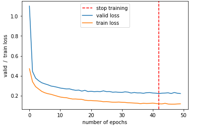
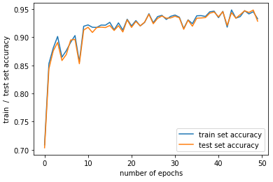
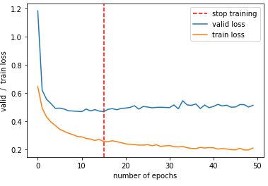
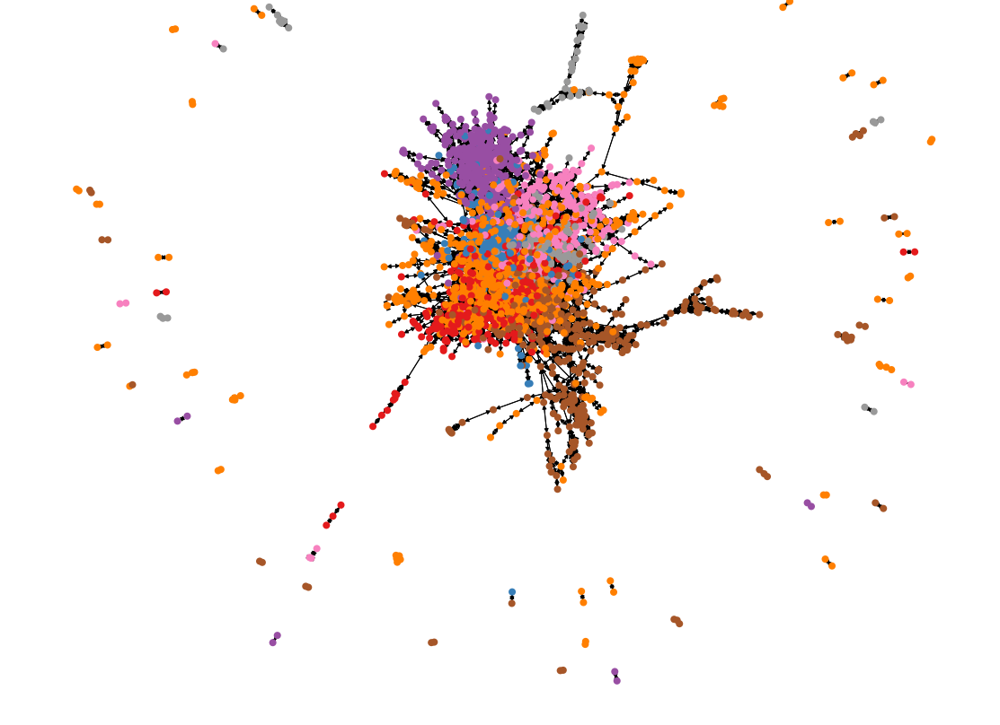
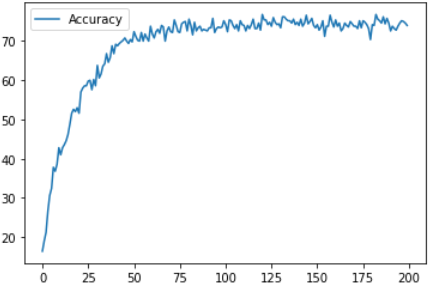
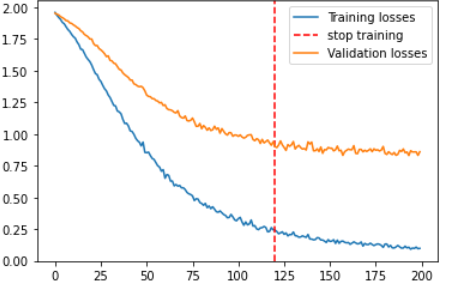

Spline graph networks

All experiments performed on a computer with the following configuration.

|CPU|GPU|RAM|
| :-: | :-: | :-: |
|AMD Ryzen 5 2600|GTX 1660 Super OC 6Gb|32 Gb DDR4|
## Category 1 experiment
The task is to prepare a program and conduct an experiment to test the effectiveness of a selected graph neural network model in an inductive approach using the graph equivalent of the MNIST set.
## Experiment 1.1

|Network architecture|
| :- |
|
Net(

`  `(conv1): SplineConv(1, 32, dim=2)

`  `(conv2): SplineConv(32, 64, dim=2)

`  `(fc1): Linear(in\_features=64, out\_features=128, bias=True)

`    `(fc2): Linear(in\_features=128, out\_features=10, bias=True)

)
|
|Optimizer|Learning rate|Number of epochs|Patience|Objective function|Learning Time|
|Adam|0.01|50|10|Cross-entropy|68 minutes|

Graph 1.1 - Visualization of the analyzed graph and image from the MNIST set.

Figure 1.2 - Percentage effectiveness for the training set

Graph 1.3 - Graph showing changes in error (objective function) during learning

The final accuracy achieved for the test set is **94.2%**. 
## Experiment 1.2 

|Network architecture|
| :- |
|
GCN2(

`  `(conv1): SplineConv(1, 64, dim=2)

`  `(conv2): SplineConv(64, 128, dim=2)

`  `(fc1): Linear(in\_features=128, out\_features=256, bias=True)

`  `(fc2): Linear(in\_features=256, out\_features=10, bias=True)

) 
|
|Optimizer|Learning rate|Number of epochs|Patience|Objective function|Learning Time|
|Adam|0.01|50|10|Cross-entropy|70 minutes|

Figure 1.4 - Percentage effectiveness for the training set

Graph 1.5 - Graph showing changes in error (objective function) during learning

The final accuracy achieved for the test set is **94.6%**. 

Reference results of obtained % classification error for a given set published in the literature for other network architectures:

|GCGP|PNCNN|Dynamic Reduction Network|
| :- | :- | :- |
|4.2|1.24|0.95|

## Category 2 experiment
The task is to prepare a program and conduct an experiment to test the effectiveness of the selected graph neural network model in the transduction case approach using an example from one of the elements in the Planetoid set.
##
## Experiment 2.1

|Network architecture|
| :- |
|
GCN(

`  `(conv1): GCNConv(1433, 32)

`  `(conv2): GCNConv(32, 7)

) 
|
|Optimizer|Learning rate|Number of epochs|Objective function|Learning Time|
|Adam|0.001|200|Cross-entropy|9.8s|

graphic 2.1 - Visualization of elements in a set

Graph 2.2 - Percentage performance for the training set

Graph 2.3 - Graph showing changes in error (objective function) during learning

The final accuracy achieved is 78.9%.
## Experiment 2.2 

|Network architecture|
| :- |
|
GCN(

`  `(conv1): GCNConv(1433, 512)

`  `(conv2): GCNConv(512, 7)

) 
|
|Optimizer|Learning rate|Number of epochs|Objective function|Learning Time|
|Adam|0.001|200|Cross-entropy|7.5s|

Figure 2.4 - Percentage effectiveness for the training set

Graph 2.5 - Graph showing changes in error (objective function) during learning

The final accuracy achieved is **79.6%**.

Reference % accuracy results obtained for a given set published in the literature for other network architectures:

|GAT|SPLINECNN|SSP|
| :- | :- | :- |
|83,00 %|89,48 %|90,160% |

